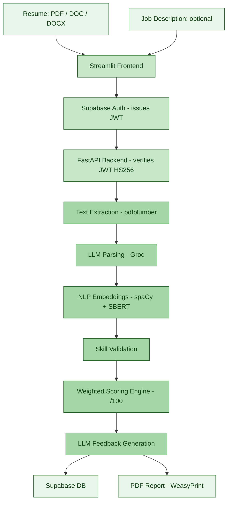
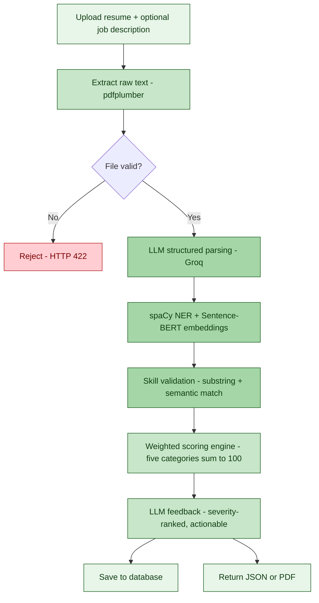
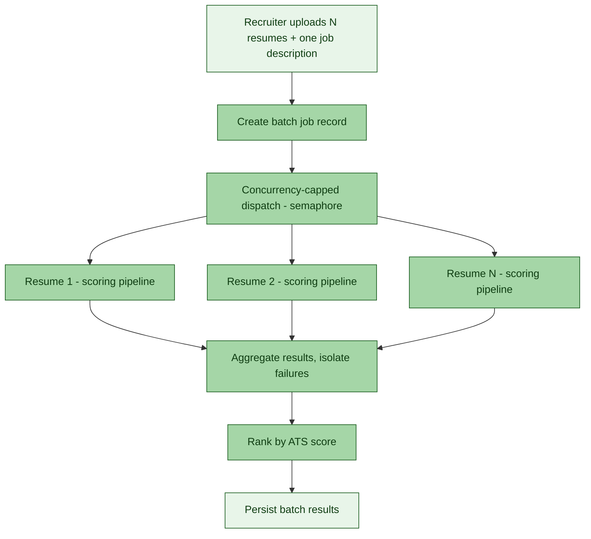

# ResumeLens


An AI-powered resume screening system that scores resumes against a job description using semantic matching, validates that claimed skills are actually backed up by evidence, and generates specific, prioritized feedback — for both individual job seekers and recruiters screening resumes in bulk.

---

## Why

Traditional ATS tools reject qualified candidates when a resume uses different wording than the job description ("developed REST APIs" vs. "backend web services"), and shortlist unqualified ones who simply list the right keywords without ever demonstrating them. ResumeLens replaces exact keyword matching with semantic comparison, and adds a skill-validation layer that checks whether a claimed skill is actually mentioned anywhere in a project or experience entry — not just listed once in a skills section.

## Features

**For candidates**
- Upload a resume (PDF / DOC / DOCX) and get a transparent ATS score out of 100, broken into five weighted categories that sum to the total — no opaque single number
- Skill validation — flags skills that are listed but never substantiated elsewhere in the resume
- Optional job description comparison — semantic similarity, matched/missing keywords, skill gap analysis
- Severity-ranked, actionable feedback with rewritten examples, not just a list of problems
- Downloadable multi-section PDF report
- Saved analysis history, accessible after signing in

**For recruiters**
- Upload multiple resumes against one job description in a single batch
- Resumes are scored concurrently (rate-limit aware) using the exact same scoring engine as the single-resume flow — no duplicated logic
- Results returned as a ranked list, sorted by score
- A single corrupted or unreadable file is isolated and reported without failing the rest of the batch
- Batch history persisted for later review

**Platform**
- Email/password and Google OAuth authentication via Supabase
- Stateless JWT verification on the backend (HS256, no database round-trip per request)

## Tech Stack

| Layer            | Technology |
|------------------|------------|
| Frontend         | Streamlit |
| Backend          | FastAPI, Uvicorn, Pydantic |
| NLP / Matching   | spaCy (`en_core_web_md`), Sentence Transformers (`all-MiniLM-L6-v2`), RapidFuzz |
| File Parsing     | pdfplumber, PyPDF2, python-docx, python-magic |
| LLM              | Groq API (Llama 3) — structured parsing and feedback generation |
| Auth             | Supabase Auth, PyJWT (HS256, verified against the Supabase JWT secret) |
| Database         | Supabase (PostgreSQL), accessed via httpx |
| Reporting        | Jinja2 + WeasyPrint |

## Architecture



### Single-resume pipeline



### Bulk / recruiter mode



## Scoring Methodology

The overall ATS score is a direct sum of five weighted categories — nothing is hidden in a re-weighted formula, so the reported total can be verified by adding the components yourself:

| Component | Max | Measures |
|---|---|---|
| Formatting | 20 | Section structure, bullet usage, summary length |
| Keyword relevance | 25 | Semantic coverage of job-description terms |
| Content quality | 25 | Action verbs, quantified achievements |
| Skill validation | 15 | Proportion of claimed skills backed by evidence |
| ATS compatibility | 15 | Parseability, absence of layout constructs automated readers can't handle |

Small bonuses apply for strong skill validation and error-free grammar; a graduated penalty applies when a large proportion of job-description keywords are missing.

## Getting Started

### Prerequisites
- Python 3.10+
- A [Supabase](https://supabase.com) project
- A [Groq](https://groq.com) API key

### Installation

```bash
git clone https://github.com/Kushagra-2112/resumelens.git
cd resumelens

python -m venv .venv
source .venv/bin/activate      # Windows: .venv\Scripts\Activate.ps1

pip install -r requirements.txt
python -m spacy download en_core_web_md
```

### Configuration

Create a `.env` file in the project root:

```env
SUPABASE_URL=your_supabase_project_url
SUPABASE_KEY=your_supabase_service_role_key
SUPABASE_ANON_KEY=your_supabase_anon_key
GROQ_API_KEY=your_groq_api_key
AUTH_REDIRECT_URL=http://localhost:8501
```

### Database setup

Run the following in Supabase's SQL Editor:

```sql
create table public.analyses (
  id                bigint generated by default as identity primary key,
  user_id           uuid not null references auth.users(id) on delete cascade,
  filename          text not null,
  ats_score         numeric,
  keyword_match     numeric,
  missing_keywords  jsonb default '[]'::jsonb,
  analysis_result   jsonb not null,
  created_at        timestamptz default now()
);

create table public.batch_jobs (
  id                bigint generated by default as identity primary key,
  user_id           uuid not null references auth.users(id) on delete cascade,
  job_description   text not null,
  total_resumes     int not null default 0,
  completed_count   int not null default 0,
  failed_count      int not null default 0,
  created_at        timestamptz default now()
);

create table public.batch_results (
  id                bigint generated by default as identity primary key,
  batch_id          bigint not null references public.batch_jobs(id) on delete cascade,
  filename          text not null,
  ats_score         numeric,
  status            text not null default 'success',
  error_message     text,
  analysis_result   jsonb,
  created_at        timestamptz default now()
);

alter table public.analyses enable row level security;
alter table public.batch_jobs enable row level security;
alter table public.batch_results enable row level security;

create policy "Users manage their own analyses" on public.analyses for all using (auth.uid() = user_id);
create policy "Users manage their own batch jobs" on public.batch_jobs for all using (auth.uid() = user_id);
create policy "Users view results of their own batches" on public.batch_results for all
  using (batch_id in (select id from public.batch_jobs where user_id = auth.uid()));
```

### Running the app

```bash
# Backend
uvicorn backend.main:app --reload

# Frontend (separate terminal)
cd frontend
streamlit run streamlit_app.py
```

App runs at `http://localhost:8501`, API at `http://localhost:8000` (interactive docs at `/docs`).

## Project Structure

```
resumelens/
├── backend/
│   ├── api/               # Routes, auth dependency
│   ├── core/               # Config, environment loading
│   ├── database/           # Supabase client and queries
│   ├── models/              # Pydantic schemas
│   ├── services/            # Parsing, scoring, feedback, PDF generation
│   ├── templates/           # Jinja2 HTML templates for PDF reports
│   ├── utils/               # File and matching utilities
│   └── main.py
├── frontend/
│   ├── components/          # Reusable Streamlit UI pieces
│   ├── services/            # API client, Supabase auth client
│   ├── views/               # Page-level views (landing, scorer, history, resources)
│   └── streamlit_app.py
├── jupyter notebooks/        # EDA, dataset cleaning, embedding validation
├── datasets/
├── requirements.txt
└── README.md
```

## Empirical Validation

Independent validation of the semantic matching approach on a cleaned dataset of 284 resume–job description pairs found a correlation of **0.827** between Sentence-BERT cosine similarity and the assigned match label, with mean similarities of 0.81 (high), 0.64 (medium) and 0.51 (low) — confirming clear separation between match tiers. A held-out evaluation of the pre-trained embedding model established a baseline **Mean Absolute Error of 0.19**, which also revealed that raw cosine similarity systematically over-estimates weak matches — the reason this project treats semantic similarity as one weighted input into the scoring engine rather than the score itself.

## Roadmap

- [ ] Fine-tune the embedding model on domain-specific resume/JD pairs
- [ ] Bias-auditing dashboard for shortlisting outcomes
- [ ] OCR support for scanned resumes
- [ ] Multilingual resume and job description support
- [ ] Public API for third-party ATS/HRMS integration

## License

This project is licensed under the MIT License — see [LICENSE](LICENSE) for details.
